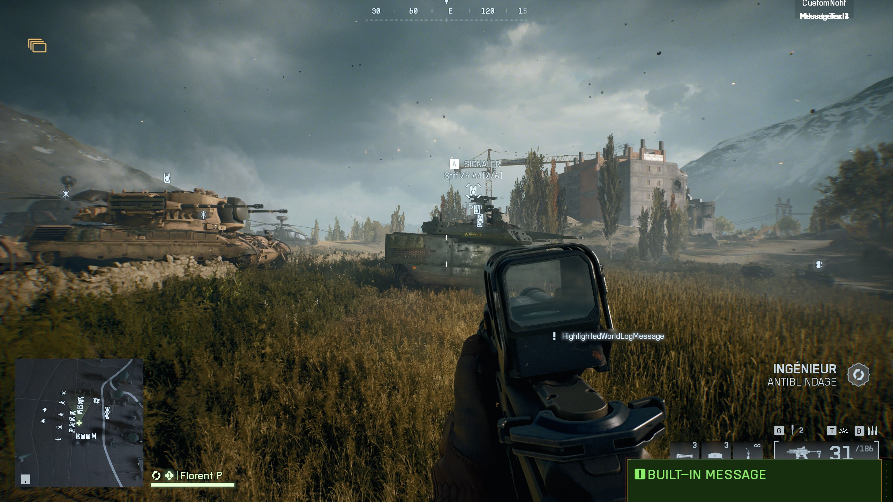

# Battlefield 6 Portal misc tutorials and tips

## Youtube and other websites

- there is a Portal channel on the official Battlefield Discord : https://discord.com/channels/140933721929940992/907670155125989456
- and an (for now empty) subreddit : https://www.reddit.com/r/Battlefield6PortalSDK/
- Two Youtube channels to follow
	- Battlefield Portal Hub : https://www.youtube.com/channel/UCEqGivH3VeJFsF7jnUWOTTw
	- Matavatar : https://www.youtube.com/@Matavatar/videos
		- videos will likely be in French, but the Battlefield Portal Hub has a translation for the introductory video
- https://bfportal.gg/ (and a dedicated Discord)


## In Godot

- For objects dragged from the Object library to stick to the terrain : in the Scene tree view, show terrain "modifiable children" to reveal the mesh, then again on the mesh to reveal the Terain, select then above the editor view, click "Mesh", then "create collision shape" then (first menu entry) then in "collision shape placement", select "static body child", then click the create button
	- now we you will add an object from the library it will touch the ground
	- the same can be done for the Assets
- Shift + G to place the selected object where the mouse is
- Ctrl + D to duplicate the current object (the name of the object will automatically be suffixed with a number, or the number suffix will be increased)
- blue arrow on the gizmo will usually be the front of the object
- press W, E to change the mode of the gizmo
- press T to toggle the Gizmo between local and global space
	- in local space the blue array is the front of the object


## Test you creation

In Godot, be sure to click the "export current level" button to have an up-to-date spatial file.

In the web Portal experience builder, configure an experience with custom game mode, and in the map rotation step, once you added the map you want on the rotation, you can upload the `.spatial.json` file you generated from Godot.

After that you can configure the rest of the experience and then you just need to save it.  
There is no need to publish it.

After a few second, it will be available in the game in "Community > My experience".  
If it doesn't appear, go back to the main menu, wait a few seconds, then try again.  

In the menu, select you experience, then at the botton select "Host localy". 
It will lanch the map with you modifications.

The next times, you can just edit your experience, delete the spatial file from the map, then upload the new one, then save.


## Working with vehicles

In Godot, in the object library, search for `VEH_`.  
You will see objects with the highlights of vehicles.

You can place these, and they will be working vehicles, but they will not respawn.  
No need to place these on the ground, a little above is fine.

To place respawnable vehicles, search for the VehicleSpawner in the object library.  
Unfortunately it always look like a small grey sphere.  
After being placed, look at the inspector and change the "Vehicle Type" property to change which vehicle will spawn there.  
You might also want to check "Auto spawn enabled" so that the vehicle spawn whenever the map starts.
The gizmo blue arrow show what will be the front of the vehicle.

As of 12/10/2025, the SU57 doesn't spawn (it is also missing it's `VEH_` model).

So far, I do not know how to have a UI where you select the vehicle from the deployment screen.


## Scripting

The Portal experience builder allow to add scripts to your experiences.

The scripts are written in Typescript, and have access to a global `mod` object with all the Battlefield6 public API available on it.

The full list of enum and functions you can call on it (and thus the full list of capabilities) can be found in the `code\mod\index.d.ts` file in the SDK.  
This file is not a script but litterally the definition of what the `mod` object contains.

There is also the `code\modlib\index.ts` script that contains various helpers that can be interesting to be used, like:
- `ParseUI()` to create UI from a JSON object tree (see example in `HoH_UIVehicleSelect` in the `AcePuisuit.ts` script)
- `DisplayCustomNotificationMessage()` to do what it says, a more flexible version of `mod.DisplayNotificationMessage()`

You can not add several scripts to your experience, so you have to concatenate whatever if you have them in several scripts during development, before you upload them.


## Creating UI

The `mod` object allow to create 2D UIs with texts, clickable buttons, images, images of weapons, images of Gadgets.
You can also add Icons to world objects.

All functions to create UI elements have several signature with more or less arguments.
See the `AddUI*` functions for the complete reference.

Several arguments are (almost) always presents:

**name: string**
This one is optional, and only needed when you need to later get the widget.  
Also, while we can or must attach a layer to the widget, the best way to later get a particular widget for a particular player is to suffix the widget name with the player id (this is what AcePursuit does).

```ts
const playerId = mod.GetObjId(player);
const name = `my_container_${playerId}`;
const widget = mod.AddUIContainer();

// later
const widget: mod.UIWidget = mod.FindUIWidgetWithName(name);
mod.SetUIWidgetVisible(widget, false); // hides the UI
```

**`position: Vector`**  
The position **relative to the parent**, in pixels. Only the `x` and `y` from the vector are used.  
The position of the (0,0) point on the widget itself relative to the parent depends on the anchor.

**`size: Vector`**  
The size in pixels. Only the `x` and `y` from the vector are used.
Note that the size seems to be approximate, and may adapt to children ?

**`anchor: UIAnchor`**  
Where, relative the parent (or the screen), is the (0,0) position of the widget. (ie: TopLeft, Center)

**`parent`**  
Optional, another widget.

**`receiver`**
Optional and always at the end of the argument list if exists, this is the player or team to which show that widget.

**`visible: boolean`**  
Self explanatory. Hiding a parent will hide all children.  

**`bg*`**
Three arguments to control the look of the background.

**`*Color: Vector`**  
The colors are given in Red/Green/Blue as a (x, y, z) vector where each components is between 0.0 (0) and 1.0 (255).  
So `Vector(1, 0, 0)` is full red, `Vector(0.5, 0.5, 1)` is violet.

All parameters can be configured when the widget is created but all widget have setters to change any of theses values later.

To maybe ease the creation of deep UIs with nested elements, you may use the helper `ParseUI()` function that takes as input a JS object with just the properties that you needs for each widget.

**Container**

A container is an empty element usefull mostly to regroup logically other children elements, as well as to create a background for the UI.

See function `AddUIContainer`.

**Button**

A clickable element, with separate base, disabled, hover, focus, presses states.

See function `AddUIButton`.

Buttons can be individually disabled, hidden, but you can also enable/disable the player to interact at all with the UI with `mod.EnableUIInputMode(true/false, player)`.

**Text**

Some text, see function `AddUIText`.

**Image**

A general image, a weapon image, or a gardget image.
The general images are fairly limmited, see the `UIImageType` enum.

See function `AddUIImage`, `AddUIWeaponImage`, `AddUIGadgetImage`

### Button interactions

The method to create button do not include the traditional argument where you would give a callback function to be called on button click.

After creating the button widget, you first need to **enable events** on them with the `mod.EnableUIButtonEvent(button: mod.UIWidget, event: mod.UIButtonEvent enabled: boolean);` function.  
Events are button up/down, focus in/out (I do not know what focus means here), and hover in/out.

Then you need to implement the following function, that is the single entrypoint for all button interactions.
```ts
OnPlayerUIButtonEvent(
    eventPlayer: mod.Player,
    eventUIWidget: mod.UIWidget,
    eventUIButtonEvent: mod.UIButtonEvent
): void 
```
In that method, you need to somehow determine what is the button that is being interacted with.  
The better way seems to get the widget name with the `mod.GetUIWidgetName(eventUIWidget)` function.  
You can check for the event with `mod.Equals(eventUIButtonEvent, mod.UIButtonEvent.FocusIn)` (a regular `==` should be OK since enum values are number ?).

And finally you need to enable the player to interact with the UI with `mod.EnableUIInputMode(enabled: boolean, player: mod.Player)`.  
After the player has done what it need, do not forget to disable the UI input mode, otherwise the players won't be able to play the game.

### Built-in message display

The `mod.Message(msg, [args])` function allows to create a string message with up to three interpolations, with the `{}` syntax.

Ie: `mod.Message("Player id: {}", mod.GetObjectId(player))` will build the message "Player id: 1" for instance.  
/!\ Important: see the **Stringkeys** paragraph below.



To display the message on screen for 6 seconds, you can use the `DisplayNotificationMessage(message, player)` while targetting everyone, a team or a player.   
It is the green message on the bottom-right on the screenshot.

But there is also `DisplayCustomNotificationMessage(message, slot, duration, player)` to control the position of the message and the duration.  
The slot is one of `CustomNotificationSlots` which tells where on the screen the message is shown (see screenshot).  
On the screenshots they are display on the top right. The several slots overlaps, yet they are supposed to be each on their on line.

And finaly there is `DisplayHighlightedWorldLogMessage(message, player)` to displays a message on the world log above the minimap for 10 seconds. 


**Stringkeys**

`mod.stringkeys` is an object automatic filled with the content of the "strings file" (`{mod name}.strings.json`).  
When building your experience with the web builder, in addition to the script, you can upload such a file.

If the file content is:
```json
{
	"key1": "hello",
	"key2": {
		"key3": "world!"
	}
}
```
Then "Hello world!" can be built like that: `mod.stringkeys.key1 + ' ' + mode.stringkeys.key.key3`.

Typically you will see scripts passing a value to `mod.Message()` from that `stringkeys` object (ie: `mod.Message(mod.stringkeys.key1)`).  
**This is not actually required.** What is needed is that the string that you pass to `mod.Message()` exists as a value in the file.


## Object Ids

In Godot, most objects have an "Obj Id" parameter, which is an integer, by default 0.  
It is useful when you want to get an objet in your script.  
The number should be unique within its type/category, it is OK forinstance that an HQ and an MCOM have the same id.

Then each type has a function to get the object, ie `mod.GetHQ(objectId): HQ`.

From an object, use `mod.GetObjId(object): number` to get the id back.

Dynamic objects that you do not place yourself, like teams, squad or even player also are considered objects and have an id that is sometimes needed to pass to other functions.
Ie: `GetTeam()` accept as argument either a Player object, or a team id.


## Built-in objects

Through the API, you can interact with severals objects like `AreaTrigger`, `CapturePoint`, `EmplacementSpawner`, `HQ`, `InteractPoint`, `MCOM`, `Player`, `ScreenEffect`, `Sector`, `SFX`, `SpatialObject`, `Spawner`, `SpawnPoint`, `Team`, `Vehicle`, `VehicleSpawner`, `VFX`, `VO`, `WaypointPath`, `WorldIcon`.

But these are not regular JS objects, they are opaque "symbols", that represents a built-in objects which internals have not been exposed.  
So they do not have accessible properties, like player.name for instance, but you may get metadata through some functions like `mod.GetObjId(object): number`.

## DeployCam

Deploy cams comes into play when you are on the deploy screen.

It is both the top down view of the whole map, and the "vignette" that you have on the bottom right when you mouse over an objective, the HQ or a squad mate.

**On HQ and Objective**

To get the deploy cam on an objective or HQ, just parent a `DeployCam` object to the `HQ_PlayerSpawner` or `CapturePoint` object. No need to orient it, the parameters of the camera are the "Camera" properties on the parent object. By default they will just orbit

**On the map itself**

This is more nebulous, it only works half the time.

You need to parent a `DeployCam` object to the top-level map object, position it at (0,0,0) (maybe change the height to be above the map, but how high doesn't seems to matter) and change its X orientation to be -90° so that it "looks down".

It will work if the view of the map in the deploy screen is indeed top-down.

Also the outlines of the combat area, or the HQ or objectives areas will not show up by default, I do not know how to do that.

**On vehicle**

This is not known. Parenting a DeployCam to a VehicleSpawner itself parented to the HQ isn't enough to create a vehicle spawn that you can select from the deploy screen, and you can link a VehicleSpawn to an HQ like you can do with InfantrySpawns.

## WorldIcon

These objects represents an icon that will be visible in 3D space where you place it on the map.
You can select the ico it will display and its color. The color must be set in RGB, with values between 0 and 1 instead of 0 and 255.

They also have parameters for a text, but even if the text match a key or a value present in the `string.json` file, it isn't visible.

